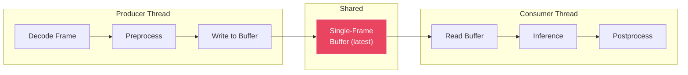
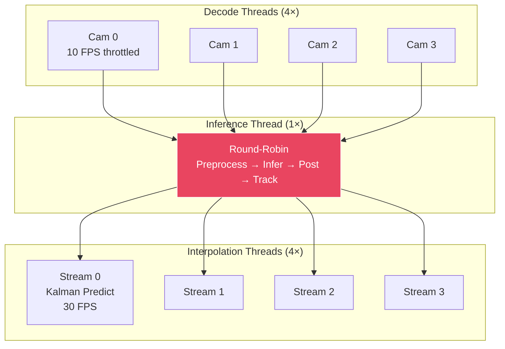

<div align="center">

# 🏗️ Real-Time YOLO11 Ops-Safety Challenge


## 📋 Problem

In industrial environments — manufacturing floors, construction sites, warehouses — automated PPE compliance and hazard detection systems must run **continuously and in real-time**. YOLO11 Large delivers the high precision needed for safety-critical detection, but:

| Constraint | Requirement |
|---|---|
| **Hardware** | 8-core CPU only (no GPU) — standard industrial PCs / edge gateways |
| **FPS** | ≥ 10 FPS effective detection rate per stream |
| **Accuracy** | mAP@0.5 degradation ≤ 2% vs FP32 baseline |
| **Streams** | 4 simultaneous camera feeds |
| **Latency** | Frame-to-alert ≤ 300 ms |
| **Memory** | Total pipeline RAM ≤ 4 GB |
| **Single frame** | End-to-end 1080p processing ≤ 100 ms |

**Baseline:** YOLO11 Large in PyTorch runs at **~2 FPS** on CPU. That's 5× too slow for a single stream and 20× too slow for four.

---

## 🏛️ Proposed Solution Architecture

We plan to build an 8-stage optimization pipeline to take YOLO11 Large from 2 FPS (PyTorch, single stream) to an expected **30 FPS effective** across 4 simultaneous streams on a CPU.


---

## 📊 Expected Results

### Target Performance

| Metric | Target | Expected |
|---|---|---|
| mAP@0.5 (INT8 vs FP32) | ≤ 2% drop | ~0.5% drop (0.800 → ~0.797) |
| Single 1080p frame latency | ≤ 100 ms | ~100 ms |
| Effective FPS (single stream) | ≥ 10 | ~30+ FPS (with tracker interpolation) |
| Effective FPS (4 streams) | ≥ 10 per stream | ~30 FPS per stream |
| Concurrent streams | ≥ 4 | 4 |
| RAM usage (4 streams) | ≤ 4 GB | < 1 GB estimated |
| Alert latency (frame → alert) | ≤ 300 ms | ~170 ms estimated |

### Planned Format Benchmarks

We will evaluate the following export formats and select the fastest for our target hardware:

| Export Format | Expected Behaviour |
|---|---|
| PyTorch FP32 | Baseline (~2 FPS) |
| TorchScript | Marginal improvement |
| ONNX | Moderate improvement |
| OpenVINO FP32 | Significant improvement |
| OpenVINO INT8 | Best expected — AVX2 optimized |
| NCNN | Alternative to evaluate |

### Detection Classes (10)

| PPE Compliance | Violations | Objects |
|---|---|---|
| Hardhat | NO-Hardhat | Person |
| Mask | NO-Mask | Safety Cone |
| Safety Vest | NO-Safety Vest | Machinery / Vehicle |

---

## 🛠️ Setup

### Prerequisites

- **Python** 3.10+
- **CPU** with AVX2 support (Intel 4th Gen+ / AMD Ryzen+)
- 8 cores recommended, minimum 4

### Installation

```bash
# Clone the repository
git clone https://github.com/<your-org>/yolo11-ops-safety.git
cd yolo11-ops-safety

# Create virtual environment
python -m venv venv
source venv/bin/activate        # Linux/macOS
# venv\Scripts\activate         # Windows

# Install dependencies
pip install -r requirements.txt
```

### Dependencies

```txt
ultralytics>=8.1.0
openvino>=2024.0
nncf>=2.7.0
opencv-python>=4.8.0
numpy>=1.24.0
scipy>=1.10.0
filterpy>=1.4.5
```

---

## � Pipeline Plan — Deep Dive

### Step 1 — Fine-Tune YOLO11 Large

**Goal:** Build a high-accuracy baseline detector for construction site safety.

- **Base model:** YOLO11 Large pretrained on COCO
- **Dataset:** [Construction Site Safety](https://universe.roboflow.com/) (Roboflow) — 10 classes
- **Data challenge:** The dataset is imbalanced — heavily skewed towards Person & Machinery. We plan to fix this with binary presence-based stratified splitting so train/valid/test splits each have proportional representation of rare classes. Underrepresented classes will be augmented with flips, rotation, and brightness transforms.
- **Training config:** 30 epochs, batch 12, image size 640
- **Expected result:** mAP@0.5 ≈ **0.800**

> [!NOTE]
> This step will establish the accuracy baseline. The model is expected to run at ~2 FPS on CPU in PyTorch — everything after this is about making it fast.

---

### Step 2 — INT8 Quantization

**Goal:** Compress FP32 weights to INT8 with ≤2% accuracy loss.

- **Method:** NNCF post-training quantization via OpenVINO. This will run a subset of validation images through the model and determine how to compress 32-bit float weights down to 8-bit integers with minimal accuracy loss.
- **Calibration:** A representative subset of validation images will be used so quantization ranges are correct.
- **Expected result:** mAP@0.5 drop of ~0.3–0.5%, well within the 2% budget.
- **Format selection:** We will benchmark every export format (TorchScript, ONNX, OpenVINO FP32, OpenVINO INT8, NCNN) and select the fastest on our target CPU with AVX2.

---

### Step 3 — Build Raw OpenVINO Inference Pipeline

**Goal:** Replace Ultralytics overhead with a lean, direct OpenVINO pipeline.

Instead of `model.predict()`, we plan to load the model directly through OpenVINO's Core API:

```python
from openvino import Core

ie = Core()
model = ie.read_model("best_int8.xml")
compiled = ie.compile_model(model, "CPU", {"PERFORMANCE_HINT": "LATENCY"})
```

**LATENCY mode** will tell OpenVINO to dedicate all CPU threads to finishing one inference as fast as possible, rather than THROUGHPUT mode which tries to batch multiple inferences.

**Custom pre/post-processing will be written from scratch:**
- **Preprocess:** Letterbox resize → 640×640 with 114-padding, BGR→RGB, normalize 0–1, HWC→CHW, add batch dim
- **Postprocess:** Transpose (1,14,8400) output, extract best class, confidence filter @ 0.4, cx/cy/w/h → x1/y1/x2/y2, undo letterbox, rescale, clip, NMS

We will verify this against Ultralytics by running the same image through both pipelines and confirming identical detections.

**Expected single-frame timing:**

| Stage | Expected Time |
|---|---|
| Preprocess | ~3–4 ms |
| Inference | ~95–100 ms |
| Postprocess | ~0.5–1 ms |
| **Total** | **~100 ms** |

---

### Step 4 — Async Producer-Consumer Pipeline

**Goal:** Eliminate sequential decode→infer blocking.

Single-threaded execution means decode and inference happen sequentially — the decode waits for inference to finish before grabbing the next frame. We plan to split this into two threads:



- **Producer** will continuously decode + preprocess frames, overwriting a 1-slot buffer with the latest frame
- **Consumer** will continuously read the freshest frame and run inference
- The buffer will hold only 1 frame — old frames will be discarded. In a safety system, stale data is dangerous.
- **Expected result:** The consumer will never wait for decode after the first frame, eliminating idle cycles.

---

### Step 5 — Kalman Filter Object Tracker

**Goal:** Maintain detections at 30+ FPS while inference only runs every Nth frame.

The model will run on every 4th frame. Between inferences, we need detections on every frame and need to track object identity across frames.

**Why not simple IoU tracking?** Between 4 skipped frames (~400ms), workers move enough that old boxes won't overlap with new detections. An IoU tracker would lose identity and create new IDs every inference.

We plan to use a **Kalman filter** instead. Each tracked object will have an 8-dimensional state: `[cx, cy, w, h, vx, vy, vw, vh]`

- **Inference frames:** Predict → match predicted positions to detections via IoU → correct state with real measurement
- **Skip frames:** Predict forward using learned velocities → output interpolated boxes

**Three planned safety mechanisms:**

| Mechanism | Purpose |
|---|---|
| **Prediction gating** (max 5 predictions) | Will prevent boxes from drifting off-screen when the model temporarily loses an object |
| **Sticky violation logic** (2-hit confirm/clear) | Will smooth out classification noise (e.g., flickering Person ↔ NO-Safety Vest) |
| **3-frame consistency rule** | Tracks must be detected in 3 consecutive inference cycles before being displayed |

**Expected result:** Raw inference FPS of ~8 → **30+ FPS effective** with the tracker filling in predicted detections on every frame.

---

### Step 6 — Multi-Stream Manager

**Goal:** 4 cameras sharing 1 model on limited CPU cores within 4 GB RAM.

Loading 4 models would blow the RAM budget. Running 4 inferences in parallel would mean each gets 25% of CPU threads and takes 4× longer per inference.

**Planned architecture:** 4 decode threads + 1 inference thread + 4 interpolation threads = **9 threads total**



**Key design decisions:**
- **Decode throttling** to 10 FPS via `sleep(0.1)` — unthrottled decode can steal CPU cycles from inference, potentially pushing inference latency to unacceptable levels
- **`cv2.setNumThreads(1)`** — limiting OpenCV's internal threads per decode to prevent thread contention with OpenVINO
- **Single model instance** — round-robin inference across all streams to stay within RAM budget
- **Per-stream locks** for tracker access and frame buffer access to ensure thread safety

**Expected result:** ~30 FPS effective per stream, total RAM well under 4 GB.

---

### Step 7 — Adaptive Resolution Scaling

**Goal:** Maintain ≥10 FPS floor even under CPU load spikes.

If CPU load spikes (thermal throttling, background processes), inference time will increase. Each stream will monitor its rolling average inference time:

```
Avg > 250ms  →  drop to 480p
Avg > 200ms  →  drop to 720p
Avg < 150ms  →  step back up to 1080p
```

- The model will always run at 640×640 internally — the savings come from faster decode, faster resize, and less CPU cache pressure
- Bounding boxes will always be scaled back to original 1080p coordinates for consistent output regardless of internal resolution

---

### Step 8 — Safety Alert System

**Goal:** Fire alerts within 300ms of a violation appearing in-frame.

The alert system will hook into the inference loop right after the tracker update:
- For every confirmed track, check if it's a violation class (`NO-Hardhat`, `NO-Mask`, `NO-Safety Vest`)
- If yes and this track+violation hasn't been alerted yet, fire an alert
- **Deduplication:** Same track ID + same violation class = one alert only
- **Multi-violation:** Same worker with two violations (e.g., no hardhat + no mask) = two separate alerts
- Each alert will record the frame timestamp and alert timestamp to measure end-to-end latency
- All alerts will be logged to `alert_log.json` with per-stream breakdown

**Expected result:** Average alert latency of ~170ms, well under the 300ms SLA.

---


## 📝 Key Design Rationale

1. **Decode thread contention is a known risk.** Unthrottled OpenCV decode can steal CPU cores from inference. We plan to throttle decode to 10 FPS and set `cv2.setNumThreads(1)` to mitigate this.

2. **Simple IoU tracking will fail with frame skipping.** Objects move too far between skipped frames. Kalman filters with velocity prediction are essential for maintaining track identity.

3. **Flickering detections are a safety hazard.** Without sticky violation logic and the 3-frame consistency rule, the system would fire and retract alerts every few frames — making it useless for operators.

4. **OpenVINO LATENCY vs THROUGHPUT is critical.** LATENCY mode dedicates all cores to one inference. THROUGHPUT mode splits cores across batched inferences. For real-time per-frame detection, LATENCY is the right choice.

5. **Single model instance for multi-stream.** Loading 4 copies of the model would use 4× RAM and fragment CPU cache. Round-robin through 1 instance will be slower per-stream but faster system-wide.

---

